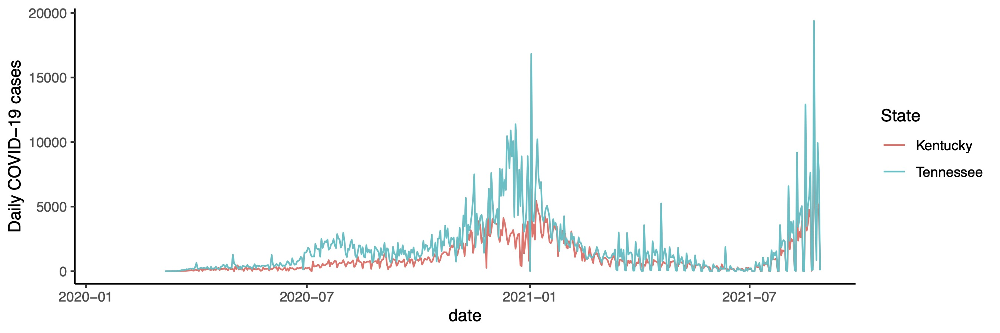

 

# Course information

|                    |                                                              |
|--------------------|--------------------------------------------------------------|
| **Instructor**     | Dr. Jeremy Van Cleve                                         |
| **E-mail**         | <jvancleve@uky.edu>                                          |
| **Phone**          | \(859\) 218-3020                                             |
| **Office**         | 216 THM                                                      |
| **Office hours**   | By appointment via e-mail                                    |
|                    |                                                              |
| **Credits**        | 3                                                            |
| **Class Time**     | TBD                                                          |
| **Class Location** | JSB 357                                                      |
| **Website**        | <https://github.com/vancleve/BIO540-DWVR> (github website)   |
|                    | <https://uk.instructure.com/courses/000000> (Canvas website) |

# Course description

The last 20 years have seen the [R programming
language](https://www.r-project.org/) rise in popularity from a language
used and developed primarily by statisticians to one used and developed
by anyone interested in analyzing and visualizing data from scientists
and engineers to historians and journalists. This **three-credit**
course aims to provide a brief introduction to using R for analyzing and
visualizing data. As R and other scripting languages have become more
popular, so have the tools required to document, maintain, share, and
replicate analyses and visualization. These activities constitute
“literate programming” and “reproducible research”, and we will use some
of these tools (particularly [`Quarto`](https://quarto.org/)).

# Prerequisites:

- Undergraduate: STA 296, STA 381, PSY 216, or equivalent statistics
  course.
- Graduate: any undergraduate statistics course.

# Student learning outcomes

1.  Execute commands in R
2.  Create [`Quarto`](https://quarto.org/) markdown documents that use
    `R` to explain and reproduce analyses
3.  Wrangle and manipulate data by slicing matrices and by using the
    `dplyr`, `tidyr`, and other `tidyverse` packages
4.  Plotting using the [`ggplot2`](http://ggplot2.org/) package
5.  Visualize multidimensional data using 2D/3D plots, networks, and
    other tools
6.  Create easily reproducible publication quality figures without
    expensive applications

# Course format

Each week will consist of a short introduction and interactive
demonstration of the concepts and tools for that week followed by a
short lab where students apply the concepts and tools. There may be
preliminary readings to do before class for some weeks (see “Topic
schedule” below and check back for updates); please make sure to do
those so that we make the most of time in class.

# Required materials

Please bring a laptop to class with a recent version of
macOS/Windows/Linux. If you need to borrow a laptop, please contact the
instructor who can help you obtain one for the semester.

# Assessment

|                            |     |                                                                                |
|----------------------------|-----|--------------------------------------------------------------------------------|
| Attendance                 | 20% | Two unexcused absences permitted without penalty                               |
| Lab work                   | 40% | Submitted as markdown file (`.qmd`) before the beginning of the following week |
|                            |     | One unexcused missing lab permitted without penalty                            |
| Data visualization project | 40% | Data analysis and figures using a dataset of your choice                       |
|                            |     | 8-10 min presentation of data and figures                                      |
|                            |     | Markdown document with data analysis and figures due on date of presentation   |

The assessment portion of the course has three components.

1.  **Class attendance**.

2.  Completion of the **lab problems** that we begin in class. This must
    be turned in as a markdown document **before class the following
    week**. If there are datasets that are required for the analysis
    (*other than datasets provided as part of the lab or lecture*),
    these should be provided along with the `Quarto` markdown file (with
    last name `qmd`) by adding all the files to a single compressed
    `zip` file. The `qmd` or `zip` file should then be uploaded to the
    [Canvas course website](https://uk.instructure.com/).

3.  **Data visualization project and presentation**. The last two weeks
    will be devoted to 8-10 minute presentations of **five** figures
    that present data from a datasets of your choice. The figures should
    be “publication quality” in terms of aesthetics (labeling, font
    size, colors, etc) but do not need a caption (that’s what the talk
    is for!). The markdown source code and any necessary data files must
    be submitted to the Canvas website as a `zip` file; compiling the
    markdown file (with `Quarto`) should produce the figures as they
    were presented during the lightning talk. If you want a challenge,
    you can even write your slides in markdown too!

    There is a ton of data out there so selecting a dataset can be
    challenging. There a few sites with lots of interesting data that
    may help get you started.

    - Kaggle. <https://www.kaggle.com/datasets>. Datasets for practicing
      machine
    - Our World in Data. <https://ourworldindata.org/>. Lots of health,
      demographic, and cultural data from around the world.
    - Dryad Data Platform. <https://datadryad.org/>. Repository freely
      reusable datasets from scientific publications focusing on ecology
      and evolution.
    - Zenodo. <https://zenodo.org/>. Open repository for code and data
      for science with more focus on physical sciences. Search only the
      datasets using [this
      link](https://zenodo.org/search?page=1&size=20&q=resource_type.type:dataset).

    Selection of the dataset can be challenging so please do not
    hesitate to consult with the instructor for help.

## Grading scale

| Undergraduate | Graduate |        | Range |     |
|---------------|----------|--------|-------|-----|
| A             | A        | 100%   | to    | 90% |
| B             | B        | \< 90% | to    | 80% |
| C             | C        | \< 80% | to    | 70% |
| D             | E        | \< 70% | to    | 60% |
| E             | E        | \< 60% | to    | 0%  |

Midterm grades will be reported to all students by the date specified in
Senate Rule 6.1.4.1.

## Graduate students

Graduate students have an additional requirement for the **data
visualization project**. The markdown document containing the data
analysis and figures should be written as a **short** project report
with the following sections:

1.  Introduction: briefly describe the problem or topic the dataset
    addresses.
2.  Data: describe how the data were originally collected and where or
    how you obtained them.
3.  Methods: describe any data wrangling that was necessary before the
    data could be analyzed and visualized.
4.  Analyses: add a brief narrative description of each analysis and
    figure and include a statement about what can be concluded from the
    figure.
5.  Conclusion: describe briefly what was learned from the analysis and
    visualization and propose a few next steps.

## Tips for making sure I can run your R code.

- For every assignment, create a separate folder for each assignment and
  put the `.qmd` file and all the other necessary files (data files,
  images, etc) in that folder.
- Zip the contents of that folder (or the folder itself) and submit that
  to Canvas.
- Use *relative* directories when pointing to files. Relative
  directories begin simply the name of the file or subdirectory of the
  current directory (I use relative directories in all the course `.qmd`
  files). That is, **avoid** putting in full directories like
  `C:\Documents\student\R\stuff\stuff.jpg` and instead simply put
  `stuff.jpg` if its in the same directory as the `.qmd`.
- Make sure your analyses run without errors and your `.qmd` can be
  compiled into a `.html` file successfully by first typing
  `rm(list=ls())` into the R console and then compiling the file. This
  will start your workspace from scratch and is also a good way of
  preventing the problem where an analysis worked when you closed R but
  now doesn’t when you reopen it.

# Getting help (i.e., uh, how do I…?)

## Classmates and instructor

1.  **Please start a discussion** on the [Canvas
    website](https://uk.instructure.com/). This will allow everyone to
    benefit from the questions and answers posed. I will monitor this
    discussion and post replies as necessary. Please also post your own
    replies too!
2.  Instructor office hours.

## Internet

1.  Stack Overflow (<http://stackoverflow.com/>). Programming and
    developer Q&A site. Search as normal for keywords, add tags enclosed
    in square brackets, e.g. \[ggplot\] or \[git\], to restrict results
    to the library or language you want answers in.
2.  Cross Validated (<http://stats.stackexchange.com/>). A site in the
    same family as Stack Overflow. Focused on conceptual and procedural
    questions in statistics (less on implementation in R or other
    languages).
3.  Google. The oldie but the goodie.

# Useful resources

## Books

There are some recent books on data science and visualization (all
written in `RMarkdown`, which is a predecessor and alternative to
`Quarto`) that cover much of the material in the course.

- Wickham, Hadley and Grolemund, Garrett. 2017/2023. R for Data Science.
  O’Reilly. <http://r4ds.had.co.nz/>
- Wilke, Claus O. 2018. Fundamentals of Data Visualization.
  <https://clauswilke.com/dataviz/>
- Healy, Kieran. 2018. Data Visualization: A Practical Introduction.
  <http://socviz.co/>
- Ismay, Chester and Kim, Albert Y. 2018. An Introduction to Statistical
  and Data Sciences via R. <https://moderndive.com/>
- Silge, Julia and Robinson, David. 2018. Text Mining with R: A Tidy
  Approach. <https://www.tidytextmining.com/>

If you want to become an R wizard in the style of Hadley Wickham, this
book is for you.

- Wickham, Hadley. 2019. Advanced R. <https://adv-r.hadley.nz/>

The following are some popular books on R. PDFs are available for “check
out” on the [Canvas website](https://uk.instructure.com/) under
“Modules: References”.

- Crawley, Michael J.. 2005. Statistics: An Introduction using R. Wiley
- Dalgaard, Peter. 2008. Introductory Statistics with R. Springer
- Murrell, Paul. 2011. R Graphics. CRC Press
- Chang, Winston. 2013. R Graphics Cookbook. O’Reilly
- Gandrud, Christopher. 2015. Reproducible Research with R and R Studio.
  CRC Press.
- Zelterman, Daniel. 2015. Applied Multivariate Statistics with R.
  Springer
- Phillips, Nathaniel. 2016. YaRrr! The Pirate’s Guide to R.
- Wickham, Hadley. 2016. ggplot2. Springer
- Wickham, Hadley and Grolemund, Garrett. 2017. R for Data Science.
  O’Reilly
- Mailund, Thomas. 2017. Beginning Data Science in R. Apress

## Internet

- Cheatsheets for RStudio and tidyverse packages
  (<https://posit.co/resources/cheatsheets/>). Cheatsheets for working
  with `ggplot2`, R Markdown, and other R packages.
- `Quarto` documentation. <https://quarto.org/docs/guide/>
- FlowingData (<http://flowingdata.com/>). Articles, examples, and
  tutorials on data visualization by Nathan Yau.
- Other data visualization and wrangling courses:
  - “Visualizing Data” by Chris Adolph (UWashington):
    <http://faculty.washington.edu/cadolph/index.php?page=22>
  - “Data wrangling, exploration, and analysis with R” by Jenny Bryan
    (UBC): <http://stat545.com/>
- DataCamp interactive courses. <http://www.datacamp.com>

# Topic schedule

The following is the preliminary schedule of topics and will be adjusted
as the semester progress.

| Week | Class Dates | Topic                                               |
|------|-------------|-----------------------------------------------------|
| 1    |             | Intro to the course and markdown, and Quarto        |
| 2    |             | Intro to R: data types, flow control, and functions |
| 3    |             | Vectors, slicing, and map(ping)                     |
| 4    |             | Getting data into R with data.frames                |
| 5    |             | Tidy Data                                           |
| 6    |             | Text manipulation: regular expressions              |
| 7    |             | Introduction to plotting and `ggplot2`              |
| 8    |             | Plot types in `ggplot2`                             |
| 9    |             | Principles of displaying data & how to modify plots |
| 10   |             | Colors and heat maps                                |
| 11   |             | Networks                                            |
| 12   |             | Visualizing/analyzing lots of data                  |
| 13   |             | Visualizing/analyzing lots of data                  |
| 14   |             | Project presentations                               |
| 15   |             | Project presentations                               |

# Course policies

## Academic policies

Please see <https://www.uky.edu/universitysenate/acadpolicy> for a full
description of UK academic policies regarding excused absences,
religious observances, accommodations due to disability, and
non-discrimination and Title IX compliance.

## Unexcused absences and late work

Unexcused absences will result in a decrease in the attendance grade and
cannot be made up. Unexcused late work may be submitted but will be
subject to a 20% penalty.

## Diversity and inclusion

Members of the course are entitled to learn from each other in an open
and welcoming environment regardless of their racial, ethnic, gender,
and sexual identities. Conduct that is not respectful of these
identities or of the national origin, religion, and political beliefs
students and instructors will not be tolerated. Please report any
concerning conduct to the instructor.

The University of Kentucky Senate Council Statement on Diversity,
Equity, and Inclusion includes important additional language and
information that applies to this course. Please refer to to [this link
for the full
statement](https://www.uky.edu/universitysenate/syllabus-dei).

## Face covering/distancing policy

- Transmission of COVID-19 is still prevalent in Kentucky. The
  instructor and students are entitled to practices that reduce
  transmission including, and not limited to, wearing a high-quality
  mask and social distancing.

- In accordance with University guidelines, these transmission reducing
  practices are optional but the instructor encourages them. If COVID-19
  is a specific risk to a student or a student has any concerns about
  classroom COVID-19 policies, please contact the instructor as soon as
  possible.

- More information about COVID-19 and UK can be found here:
  <https://coronavirus.uky.edu/>

## University resources

Please see <https://www.uky.edu/universitysenate/student-resources> for
a list of university resources including bias reporting, counseling,
disability resources, libraries, and technology support.

## Academic integrity

Per university policy, students shall not plagiarize, cheat, or falsify
or misuse academic records. Students are expected to adhere to
University policy on cheating and plagiarism in all courses.

Please the university policies on academic offenses,
<https://www.uky.edu/universitysenate/ao>, for official descriptions of
cheating and plagarism and the processes and penalties for violations of
the policies.
